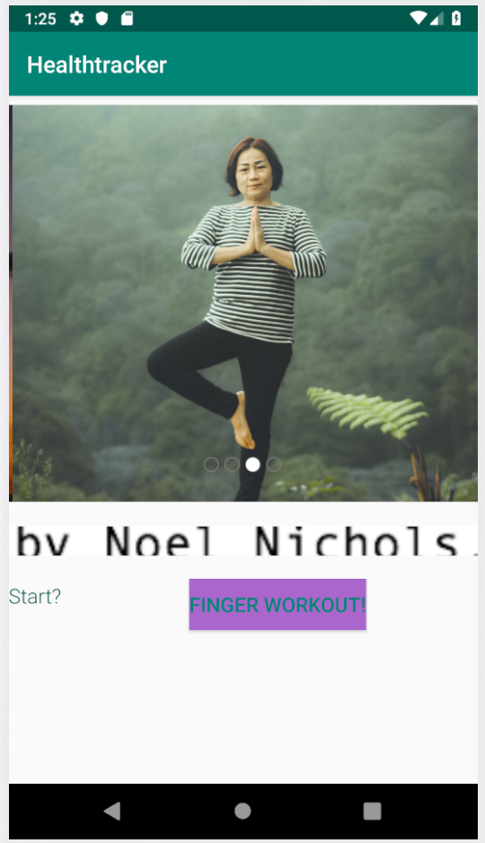
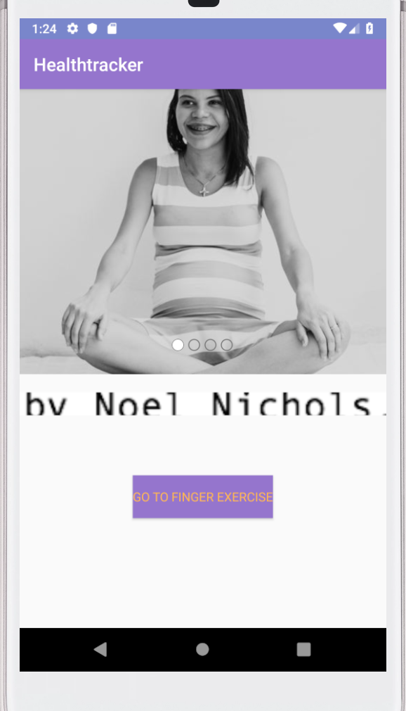
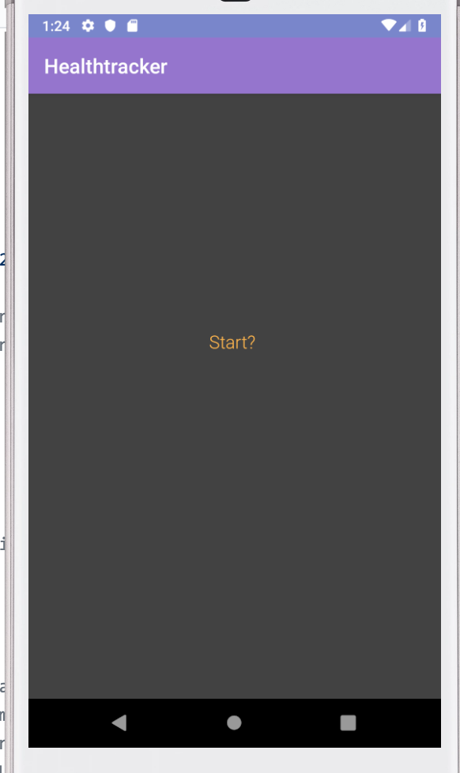

# healthtracker

## Description

## Changelog

### 5/21/19

    - added Finger Exercises on the main screen
    - added the image carousel, utilizing the [CarouselView library](https://github.com/sayyam/carouselview)
    - changed colors and base font

### 5/22/19

    - moved Finger Exercises to own screen.
        - somehow lost the button in the process. Still viable in editor view, but gone in the emulator.
        I have tried adjusting the zindex of both the background and the button, setting it to visible,
        and playing with constraints to no avail.
    - unified theme across both pages.
        - background on main still sometimes shows as white in emulator - unsure why. Always grey in emulator.
    - Added and wired a button on the front page to take you to the finger exercise page
    - reduced the image sizes of carousel images by 80%

## Features

### Finger Exercises

    When the button on the finger exercise screen is clicked, the number above it increments counting how many
    clicks the user has made.

### Inspiring Images (a work always in progress)

    The inspiring images carousel provides our users with a variety of images of what health is. The
    goal is to provide a view that will be inspiring and hopeful for someone seeking health from any
    place in life.

 [Noel Nichols on Unsplash](https://unsplash.com/photos/yOMBnHVpxdg)
 
 [Purnomo Capunk on Unsplash](https://unsplash.com/photos/kOqDOldrUR8)
 
 [alfred and joa on Unsplash](https://unsplash.com/photos/O5Wy32Um6vw)
 
 [rishikesh yogpeeth on Unsplash](https://unsplash.com/photos/CEGtclvmIII)

 CarouselView library can be found [here](https://github.com/sayyam/carouselview)
