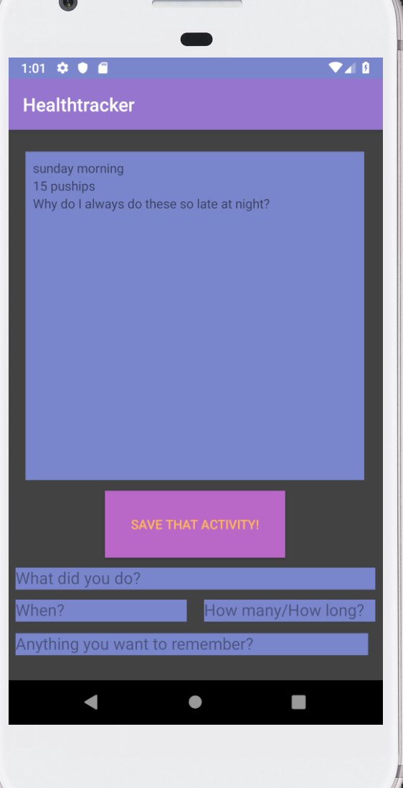
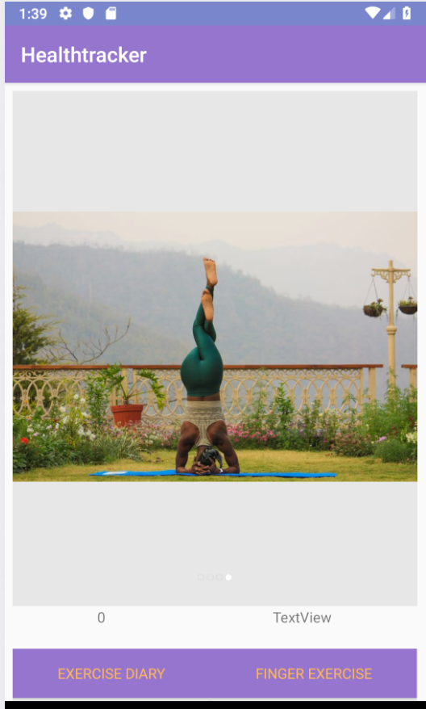
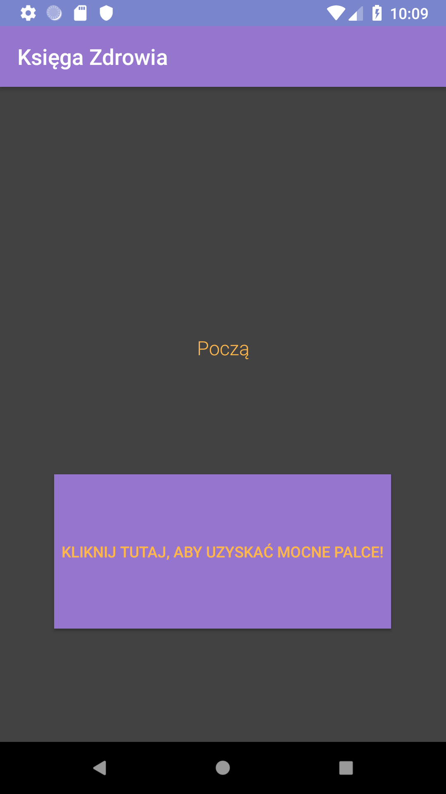

# healthtracker

## Description

## Changelog

### 5/21/19

    - added Finger Exercises on the main screen
    - added the image carousel, utilizing the [CarouselView library](https://github.com/sayyam/carouselview)
    - changed colors and base font

### 5/22/19

    - moved Finger Exercises to own screen.
        - somehow lost the button in the process. Still viable in editor view, but gone in the emulator.
        I have tried adjusting the zindex of both the background and the button, setting it to visible,
        and playing with constraints to no avail.
    - unified theme across both pages.
        - background on main still sometimes shows as white in emulator - unsure why. Always grey in emulator.
    - Added and wired a button on the front page to take you to the finger exercise page
    - reduced the image sizes of carousel images by 80%

### 5/23/19 

    - added button on main page for diary 
    - moved main page nav buttons into a vertical layout, adjusted constraints accordingly 
    - updated dependencies with variable versions, and ensured project is synced with latest versions 
    of dependencies 
    - created and wired in a Diary database using room 
    - added diary page 
        - submission form: form_Title, form_Timestamp, form_Quant, form_Description fields. 

### 5/25/19 

    - adjusted the bits necessary to get the Recycler view up and running 
    added TODO's for: 
 
        adding logic that connects my remove from recycler function and remove from database function. 
            (this is mostly a quality of life feature, but it would greatly improve future development
            and ensure a smooth UX) 
    - finished off hte button push function so that it runs cleanly, updates the recycler view, and 
    resets the form values so one knows their submission was successful. 
    - added a delete entire table method in the DAO so I can reset my Room DB when test data becomes 
    confusing. Could be a feature for users later, but is not currently added to front end. 
    

### 5/28/19 

    - finished custom carousel view 
    - added Shared Preferences file 
    - added finger clicks count to that file 
    - added cick count display and visit count display to main page 
    
### 5/30/19 

 
    - ensured there are no hard coded strings 
    - added tłumaczenia na język polski for each string in the strings.xml 
    
    - fixed null pointer issues so that Exercise Diary page will render. 
    

    
## Features

### Finger Exercises

    When the button on the finger exercise screen is clicked, the number above it increments counting how many
    clicks the user has made.

### Inspiring Images (a work always in progress)

    The inspiring images carousel provides our users with a variety of images of what health is. The
    goal is to provide a view that will be inspiring and hopeful for someone seeking health from any
    place in life.

    [Noel Nichols on Unsplash](https://unsplash.com/photos/yOMBnHVpxdg)
    [Purnomo Capunk on Unsplash](https://unsplash.com/photos/kOqDOldrUR8)
    [alfred and joa on Unsplash](https://unsplash.com/photos/O5Wy32Um6vw)
    [rishikesh yogpeeth on Unsplash](https://unsplash.com/photos/CEGtclvmIII)

    CarouselView library can be found [here](https://github.com/sayyam/carouselview)

### Exercise Diary 
    
    Allows a user to add and view activities they have done to promote their wellness. Utilizing a 
    Room SQUL lite database, recycler view, and a basic form this powerful tool assists in tracking 
    and accountability for our users. 

### Language Options 
    
    Healthtracker is offered in both English and Polish at this time, with more options in the works! 
