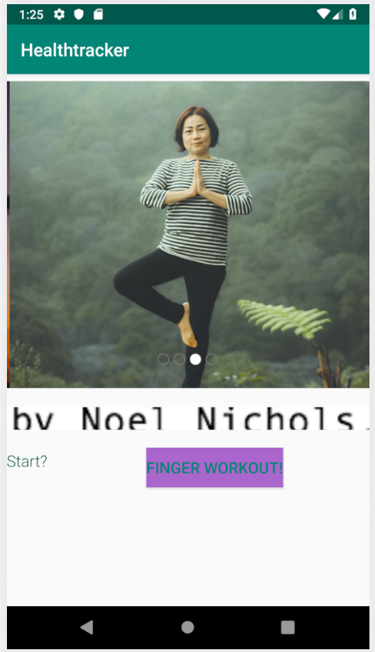

# healthtracker

## Description

## Changelog

### 5/21/19
    
    - added Finger Exercises on the main screen
    - added the image carousel, utilizing the [CarouselView library](https://github.com/sayyam/carouselview)
    - changed colors and base font

## Features

### Finger Exercises

    When the button on the main screen is clicked, the number above it increments counting how many
    clicks the user has made.

### Inspiring Images

    Unicyclist by Noel Nichols on Unsplash
    Standing Yoga Practitioner by Purnomo Capunk on Unsplash
    Legs Crossed and Seated by alfred and joa on Unsplash
    Headstand by rishikesh yogpeeth on Unsplash

    CarouselView library can be found [here](https://github.com/sayyam/carouselview)
